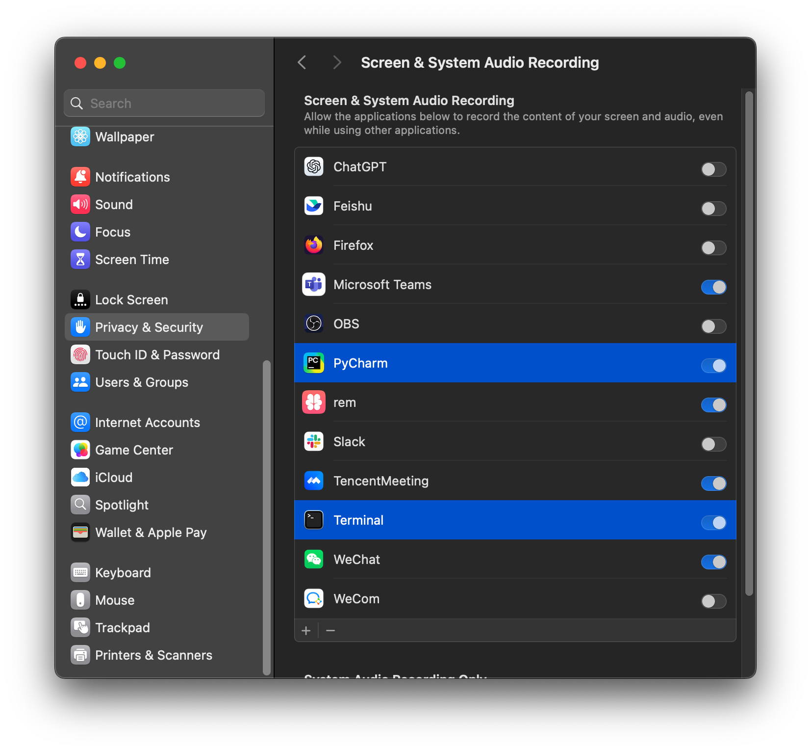
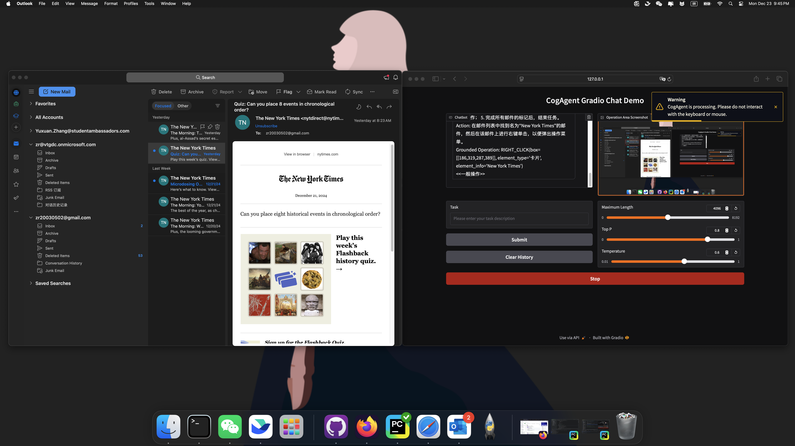

# Deploying the Demo

## System Check

The test environment for this Demo is as follows:

```
macOS Sequoia: Version 15.0.1 (24A348)
Memory: 16GB
Python Version: 3.13.1 / 3.10.16
```

For configurations different from the above (e.g., Windows OS, Linux desktop OS), we have not conducted any testing. The dependency library `pyautogui` supports Windows OS, and developers can try and enrich the Demo themselves.

## Installation (Client Side)

Before proceeding with the following steps, please ensure that you have installed all dependencies listed in the `requirements.txt` on the project homepage. These dependencies guarantee the server-side runs properly. Next, follow the steps below to install the client-side dependencies.

1. Install the `tkinter` library on your macOS system. You can refer to the following commands:

```shell
brew install python-tk
pip install -r requirements.txt
```

To verify that the system’s Python has installed the `tkinter` library correctly, type the following in the terminal:

```shell
/opt/homebrew/bin/python3 -m tkinter
```

Normally, it should return:

```
2024-12-14 15:29:04.041 Python[7161:122540731] +[IMKClient subclass]: chose IMKClient_Legacy
2024-12-14 15:29:04.041 Python[7161:122540731] +[IMKInputSession subclass]: chose IMKInputSession_Legacy
```

2. Create a virtual environment. Please do not use `conda`, `virtualenv`, or similar tools, as they may cause the `tkinter` library to malfunction. Copy and run the following command in the terminal, replacing `/Users/zr/Code/CogAgent/venv` with your actual path:

```shell
/opt/homebrew/bin/python3 -m venv --copies /Users/zr/Code/CogAgent/venv
```

You need to verify that the virtual environment has been created successfully. In the terminal, run:

```shell
/Users/zr/Code/CogAgent/venv/bin/python3 -m tkinter
```

Please ensure that a `caches` folder is created in this directory to store images during model execution:

```shell
mkdir caches
```

3. Ensure that your Mac has granted sufficient permissions to your application. Typically, the software you use to run the code needs screen capture, screen recording, and keyboard/mouse operation permissions. Below is an example of how to enable these permissions on Mac:

| Enable Screen Recording Permission        | Enable Keyboard and Mouse Permissions        |
|------------------------------------------|----------------------------------------------|
|                 |                     |

Here, we use **Pycharm** to run `client.py`. Therefore, you need to grant permissions to **Pycharm** and **Terminal**. If you only run code in the terminal, you need to grant permissions to **Terminal** only. The same applies to **VSCode** or other IDEs.

## Running the Server

Start the server on the remote machine:

```shell
python openai_demo.py --model_path THUDM/cogagent1.5-9b --host 0.0.0.0 --port 7870
```

This command launches a server on the machine that mimics the `OpenAI` interface format. By default, it will be available at http://0.0.0.0:7870.

## Running the Client

To run the client, please ensure the following:

- Confirm that the server is running properly, and verify that the remote server and your local machine are connected (through a direct connection or via any tunneling method).
- Make sure the server can be accessed from outside networks, or that your machine can reach the server via port forwarding or other tunneling methods. In our code, the server is forwarded to your local port `7870`. Hence the environment variable should be set to `http://127.0.0.1:7870/v1`.
- The Demo does not enforce an API key, so set `api_key` to `EMPTY`.

Run the client with:

```shell
python client.py --api_key EMPTY --base_url http://127.0.0.1:7870/v1  --client_name 127.0.0.1 --client_port 7860 --model cogagent1.5-9b
```

With the above commands, you can run the client locally, connect to the server, and use the cogagent-9b-20241220 model.
The image below shows the normal process of launching the app and having the model take control of the computer to capture screenshots (the small rocket in the bottom right corner of the image represents the app).



> We cannot guarantee the safety of AI behavior. Please use this demo with caution. This example is for academic reference only, and we assume no legal responsibility arising from it.
>  
> You can press `stop` at any time to forcefully terminate the current model operation.
>  
> If you believe the model is operating normally without risk, please do not interact with the computer. The model relies on real-time screenshots to determine click coordinates, which is necessary for normal operation.
